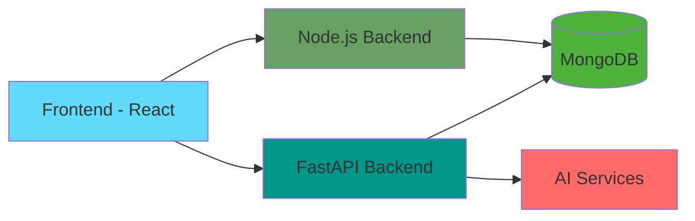

# Actify - Act Today, Impact Tomorrow 🌟

[](https://opensource.org/licenses/MIT)
[](https://www.python.org)
[](https://fastapi.tiangolo.com)
[](https://www.mongodb.com)
[](https://reactjs.org)
[](https://nodejs.org)

<div align="center">
  
  <br/>
  <strong>🌿 Empowering Communities Through Technology 🤝</strong>
</div>

## 🎯 Vision

Actify is a revolutionary platform that transforms community engagement through:

| Feature | Description |
|---------|-------------|
| 🏛️ **Community Building** | Connect and collaborate with local change-makers |
| 🌱 **Sustainability** | Drive environmental initiatives and eco-challenges |
| 💡 **Innovation** | AI-powered insights and fraud detection |
| 🤝 **Skill Exchange** | Share expertise and empower local talent |
| 📊 **Impact Tracking** | Real-time analytics and community metrics |

## ⚡ Tech Stack

### Frontend
<p align="left">
  
  
  
  
</p>

### Backend
<p align="left">
  
  
  
  
</p>

## 🏗️ Architecture



## 📦 Project Structure

<details>
<summary>Click to expand</summary>

```
Actify/
├── backend/                  # Backend services
│     ├── fastapi/           # FastAPI microservice (Python)
│     │      ├── app/        # FastAPI app with routes, models, etc.
│     │      ├── routes/     # API endpoints
│     │      ├── services/   # Business logic
│     │      └── schemas/    # Data models
│     │      
│     ├── nodejs/            # Node.js microservice
│     │      ├── src/        # Source code
│     │      ├── controllers/# Request handlers
│     │      ├── models/     # Data models
│     │      └── routes/     # API routes
│     │
│     └── db/                # MongoDB setup & data
│
├── frontend/                 # Frontend React app
│     ├── public/            # Static files
│     └── src/               # Source code
│           ├── components/  # Reusable UI components
│           ├── pages/       # Main application pages
│           ├── services/    # API integration
│           └── store/       # State management
│
└── docs/                    # Documentation
```
</details>

## 🚀 Quick Start

<details>
<summary>Prerequisites</summary>

- Python 3.8+
- MongoDB 4.4+
- Node.js 16+
</details>

<details>
<summary>Backend Setup (FastAPI)</summary>

```bash
# Navigate to FastAPI backend
cd backend/fastapi/app

# Create virtual environment
python -m venv venv
source venv/bin/activate  # On Windows: venv\Scripts\activate

# Install dependencies
pip install -r requirements.txt

# Set up environment variables
# Create .env file with:
MONGODB_URL=mongodb://localhost:27017
SECRET_KEY=your_secret_key

# Run the server
uvicorn main:app --reload
```
</details>

<details>
<summary>Frontend Setup</summary>

```bash
# Navigate to frontend
cd frontend

# Install dependencies
npm install

# Start development server
npm run dev
```
</details>

## ✨ Features

### Current Implementation
| Feature | Status |
|---------|---------|
| User Authentication | ✅ |
| CRUD Operations | ✅ |
| Location Services | ✅ |
| Basic Analytics | ✅ |

### Roadmap
| Feature | Status |
|---------|---------|
| AI Fraud Detection | 🚧 |
| KarmaCash System | 🚧 |
| Mobile App | 📋 |
| Community Leaderboards | 📋 |

## 👥 Contributing

[](https://github.com/Dhritikrishna123/Actify/graphs/contributors)
[](https://github.com/Dhritikrishna123/Actify/network/members)
[](https://github.com/Dhritikrishna123/Actify/stargazers)
[](https://github.com/Dhritikrishna123/Actify/issues)
[](https://github.com/Dhritikrishna123/Actify/blob/main/LICENSE)

<a href="https://github.com/Dhritikrishna123/Actify/graphs/contributors">
  
</a>

### Contribution Guidelines

1. Fork the repository
2. Create your feature branch (`git checkout -b feature/AmazingFeature`)
3. Commit your changes (`git commit -m 'Add some AmazingFeature'`)
4. Push to the branch (`git push origin feature/AmazingFeature`)
5. Open a Pull Request

### Top Contributors

<!-- readme: contributors -start -->
<!-- readme: contributors -end -->

### Activity


## 📄 License

This project is licensed under the MIT License - see the [LICENSE](LICENSE) file for details.

## 📬 Contact

<p align="left">
  <a href="mailto:contact@actify.com">
    
  </a>
  <a href="https://github.com/Dhritikrishna123/Actify">
    
  </a>
</p>

---

<div align="center">
  <strong>🌟 Actify – Where Community Action Meets Impact 🌟</strong>
  <br/>
  <sub>Made with ❤️ by the Actify Team</sub>
</div>